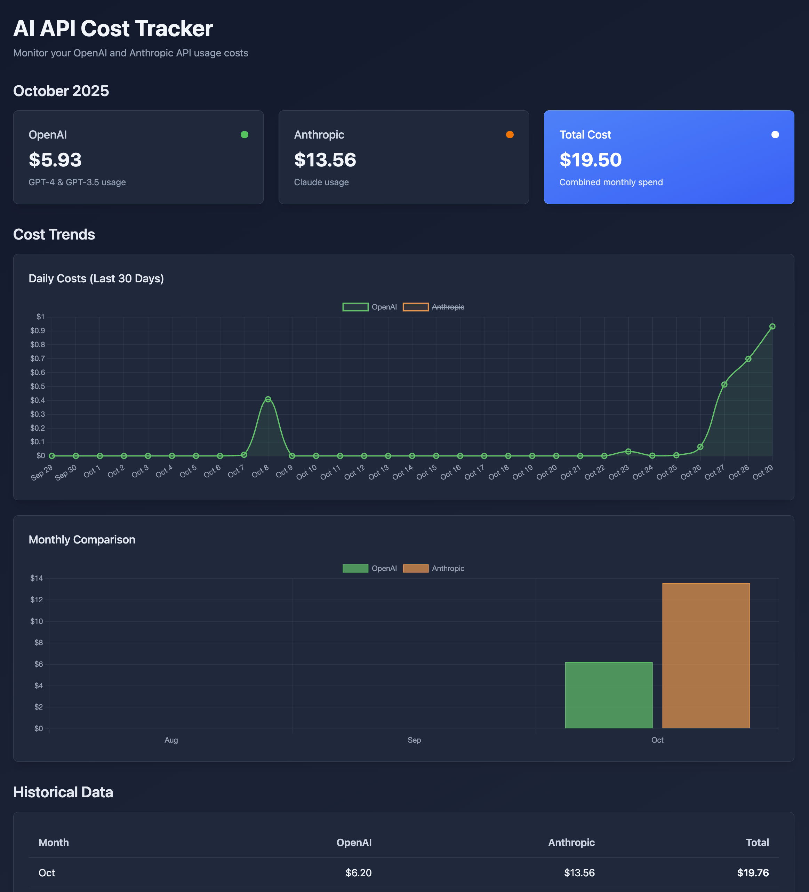

# AI API Cost Tracker

A Svelte + Vite dashboard that surfaces OpenAI and Anthropic cost data through a lightweight Node/Express proxy. The app is optimised for Docker deployment and includes client-side caching so common views load instantly.



## Features

- OpenAI and Anthropic cost aggregation via a secure proxy (`server.js`)
- LocalStorage-based caching (5 min TTL) to minimise repeat API calls
- Responsive dashboard with daily and monthly cost charts
- Graceful error states when keys are missing or providers time out
- Docker Compose stack for one-command deployment

## Tech Stack

- **Frontend**: Svelte, Vite, Tailwind CSS, Chart.js
- **Backend proxy**: Node.js (Express, native `fetch`)
- **Tooling**: TypeScript support, PostCSS, Tailwind Merge
- **Containerisation**: Docker & Docker Compose

## Requirements

- Node.js 20+ (local development)
- Docker & Docker Compose (for containerised deploys)

## Environment Variables

Create a `.env` file (or update the existing one) before running the app. Example:

```env
# API keys
VITE_OPENAI_API_KEY=sk-...
VITE_ANTHROPIC_API_KEY=sk-ant-...

# Optional overrides
PORT=3001          # Express proxy port
VITE_PORT=5173     # Vite/Serve port
VITE_API_PROXY_URL=http://localhost:3001
```

> ℹ️ `.dockerignore` excludes `.env`, but `docker-compose.yml` mounts it at runtime, so the keys are still available inside containers.

## Local Development

1. Install dependencies
   ```bash
   npm install
   ```
2. Copy and edit environment variables
   ```bash
   cp .env.example .env
   # then add/update your keys
   ```
3. Start both proxy and frontend (recommended)
   ```bash
   npm run dev:all
   ```
   - Vite dev server: `http://localhost:5173`
   - API proxy: `http://localhost:3001`

   Or start them separately with `npm run server` and `npm run dev`.

The browser cache stores the most recent summary, monthly, and daily data for 5 minutes. Refreshing within that window reuses cached results unless the proxy configuration changes.

## Docker Deployment

1. Ensure `.env` contains valid keys (same as local dev).
2. Build and start the stack
   ```bash
   docker-compose up -d --build
   ```
3. Visit the dashboard:
   - Host machine: `http://localhost:5173`
   - Other LAN devices: `http://<HOST_IP>:5173`
4. Useful commands
   ```bash
   docker-compose logs -f       # stream logs
   docker-compose down          # stop containers
   ```

## Project Structure

```
ai-cost-checker/
├── docker-compose.yml          # Frontend + proxy services
├── Dockerfile                  # Multi-stage build for production
├── server.js                   # Express proxy for provider APIs
├── src/
│   ├── App.svelte              # Root Svelte component
│   ├── main.js                 # Vite entry point
│   ├── app.css                 # Tailwind directives
│   └── lib/
│       ├── Dashboard.svelte    # Dashboard page
│       ├── components/         # Chart components
│       ├── services/           # OpenAI/Anthropic/cost tracker services
│       └── utils.ts            # Shared helpers
└── public/                     # Static assets
```

## Available npm Scripts

- `npm run dev` – Vite dev server only
- `npm run server` – Express proxy only
- `npm run dev:all` – Proxy + Vite concurrently
- `npm run build` – Production build
- `npm run preview` – Preview the production build locally

## Data Caching Behaviour

- Summary, monthly, and daily responses are cached in `localStorage` with a 5‑minute TTL.
- Cache keys are tied to the proxy configuration (which providers are enabled), so updating API keys or toggling services invalidates stored data.
- To force a refresh, clear browser storage or wait for the TTL to expire.

## Troubleshooting

- **“No API keys configured”** – Confirm `.env` includes `VITE_OPENAI_API_KEY` or `VITE_ANTHROPIC_API_KEY`, then rebuild/restart the stack.
- **504 Gateway timeout** – The upstream provider timed out. Refresh after a short delay; cached data remains available until a fresh fetch succeeds.
- **Different ports** – Set `PORT`/`VITE_PORT` in `.env` and rebuild (`docker-compose up --build`) so both proxy and frontend pick up the new values.

## API Endpoints Used

- **OpenAI**: `GET /v1/organization/costs`
- **Anthropic**: `GET /v1/organizations/cost_report` and `GET /v1/organizations/usage_report/messages`

The browser always calls the local proxy (`server.js`), which injects the API keys server-side to keep credentials out of the client bundle.

### OpenAI requirements

1. Generate an API key from the [OpenAI platform](https://platform.openai.com/api-keys).
2. Ensure the key has organisation billing access (project-scoped keys are insufficient).
3. Set `VITE_OPENAI_API_KEY` in `.env`, then restart the proxy.

### Anthropic requirements

1. Create an Admin API key in the [Anthropic Console](https://console.anthropic.com/) (admin role required).
2. Set `VITE_ANTHROPIC_API_KEY` in `.env`, then restart the proxy.

> Without at least one valid key, the dashboard will surface a configuration error instead of sample data.

## Charts and Visualizations

The dashboard includes:
- **Daily Cost Trends**: Line chart showing costs over the last 30 days
- **Monthly Comparison**: Grouped bar chart comparing OpenAI vs Anthropic costs by month
- **Historical Table**: Tabular monthly breakdown with totals

## Future Enhancements

- [ ] Export data to CSV/Excel
- [ ] Set up cost alerts and budgets
- [ ] Add usage breakdown by model
- [ ] Implement authentication
- [ ] Add date range selector
- [ ] Support for more AI providers (Azure OpenAI, Google AI, etc.)

## License

MIT

## Contributing

Contributions are welcome! Please feel free to submit a Pull Request.
